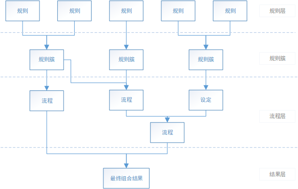

# 规则库
  * 该框架思想，主要是以减少重复功能的开发量和维护成本为目的，将相同类型的产品拆解流程，并将流程细化到具体逻辑规则，最后通过组合规则来快速生产一款产品。

----

## 规则库意义
规则库适用于构建逻辑功能大量重复，且生产量多的产品。  

就以棋牌类产品为例，国内的地方棋牌游戏的种类繁多，但玩法上有许多相似的地方。所以，对于这种类型的产品，就可用规则库的方式进行构建，将玩法拆分为规则，在通过规则组合出不同玩法的棋牌游戏。

## 规则库层级

规则库主要是四层结构，包括**规则层、规则簇、流程层、最终结果层**。如下图所示。  

  

以下主要针对这三个层级进行解释。

### 1. 规则层

该层是规则库的基础层，可以说，**规则是规则库的最小单位元素**。  

规则作为最小单位元素，必须确保其功能单一，但同时得保证规则的完整逻辑性的同时，不依赖其他具体规则，但可在一定程度上调用**设定**（一种特殊的流程）的执行。  

#### 功能单一
  * 指该条规则的功能只限定于做某一件事，同时该事件不能复杂。

#### 完整逻辑性
  * 指该条规则虽只限于做某一件事，但不能将粒度划分得太小，必须让使用者能明白该规则的作用，且不会产生理解上的歧义。

#### 不依赖其他具体规则
  * 即规则与规则之间，不能相互依赖。

### 2. 规则簇
顾名思义，该层主要是将相同类型或作用目标一致的规则，合并成一簇，方便管理。

### 3. 流程层

该层是在规则簇之上的层级，**流程（或设定）可由不同的规则簇或流程组合而成**。  

在这一层，会将规则簇组合成流程，甚至还会将一些子流程组合成更大的流程。  

而流程之间可能存在执行顺序的先后，即流程之间可能存在着依赖关系（某些流程必须在另一些流程之前执行）。  

#### 设定
设定是一种流程层中特殊的元素，其可由规则簇或其他设定组合而成，但不能使用流程进行组合。  

其最特殊的地方在于，规则层可以通过执行设定来使用其结果。  

### 4. 最终组合结果
通过不同流程和设定的组合，最终得到理想的组合结果。

## 规则库扩展

对于规则库代码层面上的实现，可以采用[行为树](../behaviortree/README.md)的方式进行设计。  

其中规则对应行为树的行为节点，流程对应为一种行为，当多种行为进行组合，就形成了一个完整的个体（对应规则库的最终组合结果）。  